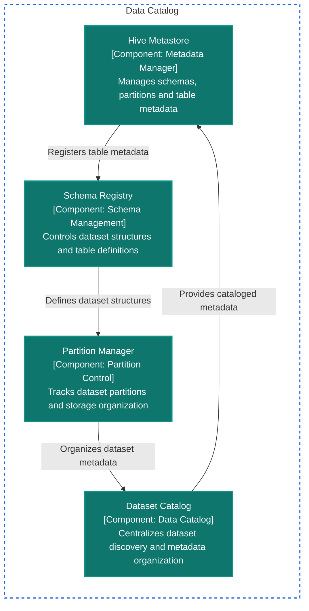

```mermaid
flowchart TB

    %% =====================================================
    %% CONTAINER BOUNDARY
    %% =====================================================

    subgraph CATALOG_BOUNDARY["Data Catalog"]

        direction TB

        METASTORE["Hive Metastore<br/>[Component: Metadata Manager]<br/>Manages schemas, partitions and table metadata"]

        SCHEMA["Schema Registry<br/>[Component: Schema Management]<br/>Controls dataset structures and table definitions"]

        PARTITION["Partition Manager<br/>[Component: Partition Control]<br/>Tracks dataset partitions and storage organization"]

        CATALOG["Dataset Catalog<br/>[Component: Data Catalog]<br/>Centralizes dataset discovery and metadata organization"]

    end

    %% =====================================================
    %% FLOWS
    %% =====================================================

    METASTORE -->|Registers table metadata| SCHEMA

    SCHEMA -->|Defines dataset structures| PARTITION

    PARTITION -->|Organizes dataset metadata| CATALOG

    CATALOG -->|Provides cataloged metadata| METASTORE

    %% =====================================================
    %% COLORS
    %% =====================================================

    %% Metadata Components
    classDef metadata fill:#0F766E,stroke:#0D9488,color:#FFFFFF,stroke-width:2px;

    %% Boundary
    style CATALOG_BOUNDARY fill:none,stroke:#2563EB,stroke-width:2px,stroke-dasharray: 5 5

    %% =====================================================
    %% CLASS ASSIGNMENT
    %% =====================================================

    class METASTORE,SCHEMA,PARTITION,CATALOG metadata;
```
