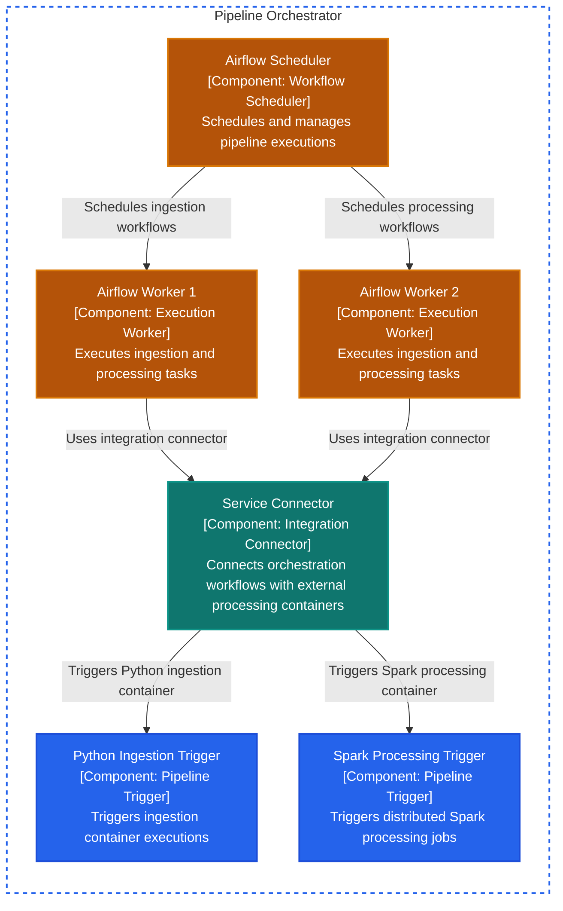

```mermaid
flowchart TB

    %% =====================================================
    %% CONTAINER BOUNDARY
    %% =====================================================

    subgraph ORCHESTRATOR_BOUNDARY["Pipeline Orchestrator"]

        direction TB

        SCHEDULER["Airflow Scheduler<br/>[Component: Workflow Scheduler]<br/>Schedules and manages pipeline executions"]

        WORKER_1["Airflow Worker 1<br/>[Component: Execution Worker]<br/>Executes ingestion and processing tasks"]

        WORKER_2["Airflow Worker 2<br/>[Component: Execution Worker]<br/>Executes ingestion and processing tasks"]

        CONNECTOR["Service Connector<br/>[Component: Integration Connector]<br/>Connects orchestration workflows with external processing containers"]

        PYTHON["Python Ingestion Trigger<br/>[Component: Pipeline Trigger]<br/>Triggers ingestion container executions"]

        SPARK["Spark Processing Trigger<br/>[Component: Pipeline Trigger]<br/>Triggers distributed Spark processing jobs"]

    end

    %% =====================================================
    %% FLOWS
    %% =====================================================

    SCHEDULER -->|Schedules ingestion workflows| WORKER_1

    SCHEDULER -->|Schedules processing workflows| WORKER_2

    WORKER_1 -->|Uses integration connector| CONNECTOR

    WORKER_2 -->|Uses integration connector| CONNECTOR

    CONNECTOR -->|Triggers Python ingestion container| PYTHON

    CONNECTOR -->|Triggers Spark processing container| SPARK

    %% =====================================================
    %% COLORS
    %% =====================================================

    %% Orchestrator Components
    classDef orchestration fill:#B45309,stroke:#D97706,color:#FFFFFF,stroke-width:2px;

    %% Connector
    classDef connector fill:#0F766E,stroke:#0D9488,color:#FFFFFF,stroke-width:2px;

    %% Trigger
    classDef trigger fill:#2563EB,stroke:#1D4ED8,color:#FFFFFF,stroke-width:2px;

    %% Boundary
    style ORCHESTRATOR_BOUNDARY fill:none,stroke:#2563EB,stroke-width:2px,stroke-dasharray: 5 5

    %% =====================================================
    %% CLASS ASSIGNMENT
    %% =====================================================

    class SCHEDULER,WORKER_1,WORKER_2 orchestration;

    class CONNECTOR connector;

    class PYTHON,SPARK trigger;
```
